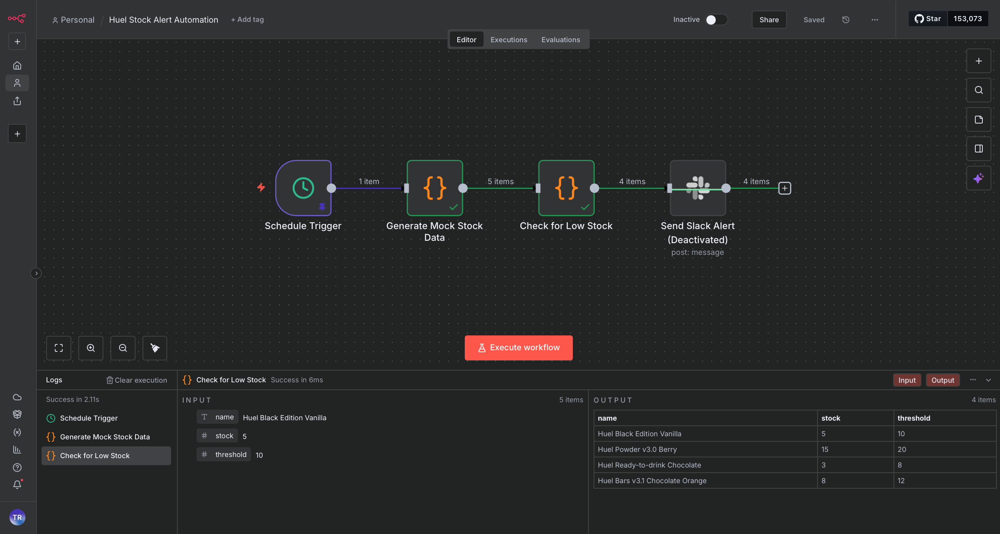

# Huel Stock Alert Automation (n8n Workflow)

A mini **n8n workflow** that monitors product stock levels and sends alerts when inventory is low—built to demonstrate how I’d approach automation at **Huel**.

## 📌 Why This Project?

Huel’s operations likely involve tracking inventory for powders, bars, and ready-to-drink products. This workflow automates stock checks to:

- **Save time** (no manual spreadsheet checks).
- **Reduce errors** (alerts trigger when stock hits a threshold).
- **Integrate easily** (works with APIs, CSV, or databases).

## 🛠 How It Works

1. **Fetches stock data** (from a mock API or CSV).
2. **Checks for low stock** (using a Function node).
3. **Sends alerts** (email/Slack) with actionable details.



## 🚀 Try It Yourself

1. **Import the workflow**:
   - Download [`workflow.json`](workflow.json).
   - In n8n, click **"Import"** → upload the file.
2. **Set up data**:
   - Use the [mock API](https://mockapi.io/) or replace with your own data source.
3. **Run it**!
   - The workflow will log low-stock items and send a test alert.

## 🔧 Customizations for Huel

- **Connect to Shopify/ERP**: Replace the HTTP Request node with Huel’s actual inventory API.
- **Add supplier integration**: Auto-generate purchase orders when stock is low.
- **Dashboard**: Log alerts to a Google Sheet for trend analysis.

## 💡 Why n8n?

- **Low-code**: Easy for non-developers to maintain.
- **Scalable**: Can integrate with Huel’s existing tools (Slack, email, databases).
- **Cost-effective**: Open-source and cloud-friendly.

---
**Built by Tania Rosa | linkedin.com/in/tania-rosa-99503b36 | <trsdeveloper@proton.me>**
```text
   ┌────────────────────────┐
   │   AI-GENERATED ✅      │
   │   HUMAN-VERIFIED 🧠    │
   └────────────────────────┘
```
![AI generated - Human Verified]
(http://img.shields.io/badge/AI%20verified-007EC6)

